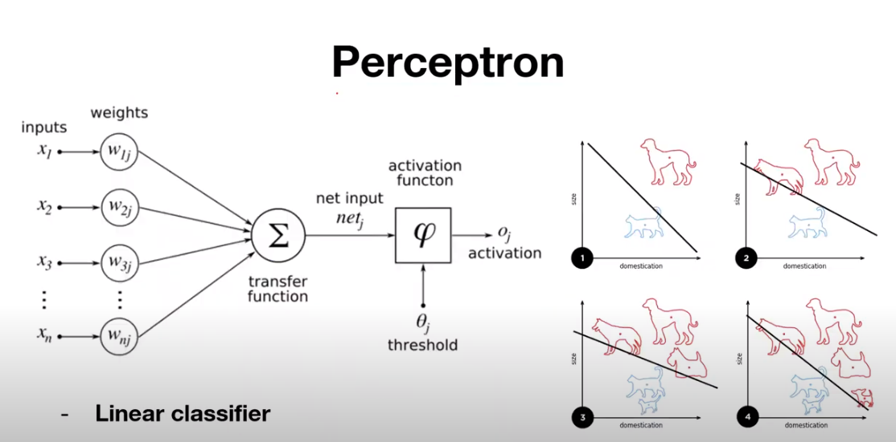
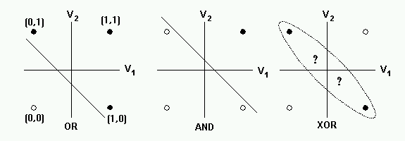
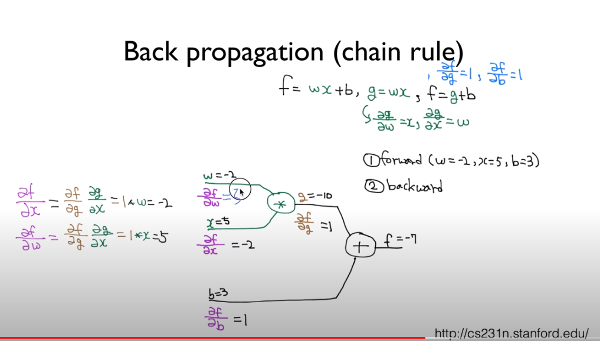
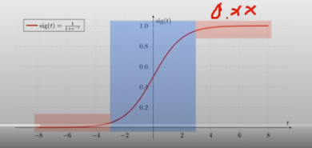
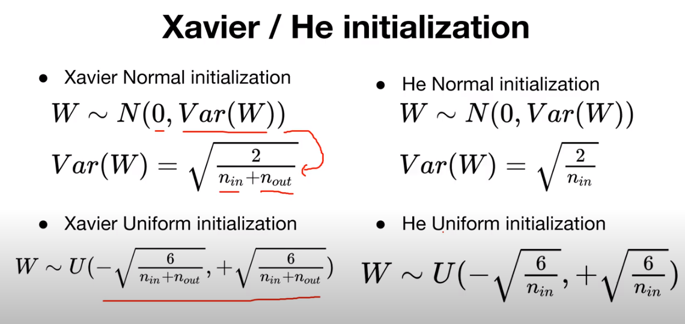

# Perceptron
 - 인공신경망(Neuron 의 동작 방식)의 한 종류
   
  
 - weight(가중치)는 각각의 입력신호와의 계산을 하고 신호의 총합이 threshold를 넘으면 1, 넘지 못하면 0 or -1을 출력한다. 
 - input X * w + Bias -> ouput 
 - output은 activation function (예 sigmoid)을 거쳐 최종적 결정.
 * 퍼셉트론의 출력값은 1 or 0(또는 -1) 이므로
  -> **linear classifier**  즉, 선형 분류 모형 -> And, OR 문제는 해결가능
  
 * **but, XOR 문제 해결이 불가능.** -> **multi layer** 이 필요하다.
 
 
# BackPropogation 
- output과 정답(target)간 loss(cost)를 최소화 하기 위해 각 노드의 변수들(weight,bias)을 뒷 층에서부터 역으로 갱신하는 알고리즘.
- 어떻게 각 노드의 weight와 bias 를 업데이트 할 것인가?
  -> 미분의 연쇄법칙( Chain Rule) 을 이용.
  
  
- pyTorch의 ``cost.backward() `` 통해 실행.

# RELU activation
* Sigmoid 의 문제점
 - backpropogation 알고리즘에서 activation 값에 graident를 곱할 때
 뒷 단에서 부터 gradient 가 소멸되는 문제(그림의 빨간색 부분 :  gradient 가 0에 가까우므로)  -> Vanishing Gradient
 
 - Layer이 많이 사용 되었을 경우 더 문제가 됨.
 
* ReLU fuction
		                    f(x) = max(0,x)
	-  음수영역에서는 gradient 가 0이므로 문제 발생 가능.
* pyTorch code
	- torch.nn.sigmoid(x) 대신 torch.nn.relu(x) 사용 가능
	- torch.nn.leaky_relu(x,0.01) - x가 음수인 부분에서 완화시켜주는 함수.

* Optimizer in PyTorch
  https://pytorch.org/docs/master/optim.html  참조.

# Weight의 초기화
- weight initialize : 학습 정도와 성능에 영향을 미침.
- weight를 모두 0으로 초기화 하면 안됨 !
1. Restricted Boltzman Machine (RBM ) 이용한 pre training
 -> 복잡하므로 많이 사용하지 않음.
2. Xavier/He initialization 
	
	
	
	* n in, n out : 초기화하고자 하는 data의 input, output 수
	* PyTorch code
	``torch.nn.init.xavier_uniform_(linear1.weight)``

# Overfitting
- train data에서는 high accuracy ,test data에서는 poor accuracy 
- Solutions
	 1. training data 추가
	 2. feature의 갯수 줄이기
	 3. Regularization
	 4. **Dropout**
* Dropout
 - 각 layer의 노드들을 사전에 설정된 확률에 따라 무작위로 선택해서 사용하는 방식.
 - 성능을 향상, overfitting 방지
 - 여러형태의 network 형성하므로써 앙상블의 효과 얻음.
 - 단, train시에는 설정 확률에 따라 novel을 선택해서 train 하지만,
   test시에는 모든 novel을 활용하여 test 하므로 주의할 것.
   
   	```python
   model.train() # model을 train모드로 선언 ( dropout= True)
   for epoch in range(training_epochs):
	#training code
	# Test model
	with torch.no_grad():
	model.eval() #model을 test mode로 설정( dropout=False)
	```

# Batch Normalization
- Gradient Vanishing / Exploding 의 문제 발생시 solution
	1. activation function 변경 (ex) sigmoid -> relu
	2. weight initilization 변경
	3. learning rate를 minimize
	4. **Batch normalization**
	-> 위 방법들과는 달리 전체적인 학습과정을 stable 하게하는 직접적인 해결 방법
	- 한 layer들 마다 가지고 있는 covariant shift 문제를 해결하기 위해 사용
	- 학습 시 계산된 sample mean과 variance 를 따로 저장후 
	learning mean learning variance로 저장 -> 이 값을 이용 normalize
 
